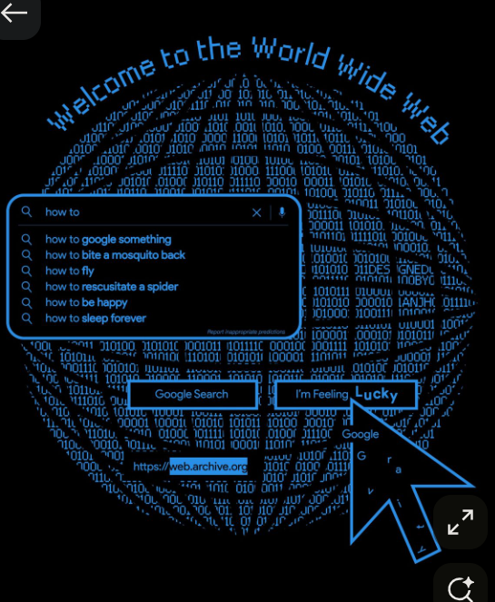

<div align="center">


</div>

<br/>

<div align="center">

[](https://www.python.org/)
[](https://fastapi.tiangolo.com/)
[](https://www.uvicorn.org/)
[](https://www.sqlalchemy.org/)
[](https://www.sqlite.org/)
[](https://jwt.io/)
[](https://developers.google.com/identity)

[](https://developer.mozilla.org/docs/Web/JavaScript)
[](https://developer.mozilla.org/docs/Web/HTML)
[](https://developer.mozilla.org/docs/Web/CSS)
[](https://www.docker.com/)
[](https://vercel.com/)

[](https://openai.com/)
[](https://www.virustotal.com/)
[](https://www.shodan.io/)
[](https://haveibeenpwned.com/)
[](https://github.com/)

</div>

<br/>

**AP Console** (Authenticity & Provenance Console) is a full-stack investigative dashboard that fuses **two toolsets into one dark "forensics lab" UI**, behind a single FastAPI backend:

1. 🖼️ **Media forensics** — upload an image, video, or voice clip (or run a live webcam scan) and get a manipulation-confidence score with a signal-by-signal breakdown.
2. 🕵️ **Threat intel / exposure watchdog** — enter a company domain or email and check leaked credentials, phishing look-alike domains, exposed secrets on GitHub, exposed infrastructure, and ransomware leak-site mentions, with an AI-generated risk summary and a follow-up chat box.
3. 🔐 **Google Sign-In + case history** — every analysis and scan a signed-in investigator runs is saved and reopenable later from the **History** tab.

> [!NOTE]
> The threat-intel side runs **fully in demo mode with zero API keys** — every checker has a deterministic mock fallback, and every finding in the UI is tagged `live` or `mock`.

---

## 📚 Table of Contents

- [✨ Features](#-features)
- [🏗️ Architecture](#️-architecture)
- [🗂️ Project Structure](#️-project-structure)
- [🛠️ Tech Stack](#️-tech-stack)
- [🚀 Run It](#-run-it)
- [🔑 Login (Sign in with Google)](#-login-sign-in-with-google)
- [📡 API Reference](#-api-reference)
- [🔬 Media Forensics — What's Real](#-media-forensics--whats-real)
- [🕵️ Threat Intel — What's Real vs. Mock](#️-threat-intel--whats-real-vs-mock)
- [📷 Live Webcam Mode](#-live-webcam-mode)
- [🧊 Roadmap — 3D & Beyond](#-roadmap--3d--beyond)
- [🔒 Privacy at a Glance](#-privacy-at-a-glance)
- [☁️ Deployment](#️-deployment)
- [⚠️ Known Limitations](#️-known-limitations)
- [📜 License](#-license)

---

## ✨ Features

| | Exhibit | What it does |
|---|---|---|
| 🖼️ | **Image Forensics** | FFT artifact analysis, Error-Level Analysis (ELA), sensor-noise consistency, facial symmetry |
| 🎞️ | **Video Forensics** | Frame sampling + blink-rate + temporal-consistency analysis |
| 🎙️ | **Voice Forensics** | Pitch, spectral, and MFCC analysis to flag synthetic/cloned voices |
| 📷 | **Live Feed** | Real-time webcam scan — same pipeline as an image upload, nothing stored server-side |
| 🕵️ | **Threat Intel** | Breach data, phishing look-alikes, exposed secrets, exposed infra, ransomware mentions, AI risk summary + chat |
| 🕓 | **Case History** | Every signed-in scan is saved & reopenable, filterable by type, private per user |


---

## 🗂️ Project Structure

```
AP-console/
├── backend/
│   ├── app.py                    single FastAPI server, both APIs, login + history
│   ├── database.py                SQLAlchemy engine/session (SQLite by default)
│   ├── models.py                  User + Case (history) tables
│   ├── auth.py                    Google ID-token verification + session JWTs
│   ├── requirements.txt
│   ├── .env.example               optional keys for live threat-intel data + login/DB config
│   ├── ap_console.db              (created on first run) local SQLite database
│   ├── detectors/                 media forensics (image/video/audio)
│   │   ├── image_detector.py      FFT / ELA / noise / symmetry analysis
│   │   ├── video_detector.py      frame sampling + blink-rate + temporal
│   │   └── audio_detector.py      pitch / spectral / MFCC voice analysis
│   └── checkers/                  threat-intel exposure checks
│       ├── breach.py               HaveIBeenPwned (live) / mock
│       ├── phishing.py             VirusTotal reputation (live) + lookalikes (mock)
│       ├── github_secrets.py       GitHub code search (live, no key required)
│       ├── shodan_check.py         Shodan (live) / mock
│       ├── ai_summary.py           OpenAI summary + chatbot (live) / template
│       └── mock.py                 deterministic mock-data generators
├── frontend/
│   ├── index.html                 login page + 6 exhibits
│   ├── style.css                  shared "forensics lab" design system
│   └── script.js                  login, upload UI, gauge, webcam loop, intel scan + chat, history
├── Dockerfile
├── Procfile
├── vercel.json
└── README.md
```

---

## 🛠️ Tech Stack

<div align="center">

| Layer | Technology |
|---|---|
| **Backend framework** |  +  (ASGI server) |
| **Language** |  |
| **Database / ORM** |   (swap in Postgres/MySQL via `DATABASE_URL`) |
| **Auth** |  +  app sessions |
| **Frontend** |    (vanilla, no build step) |
| **Media processing** | Pillow, NumPy — FFT / ELA / noise / pitch / MFCC signal analysis |
| **Threat intel APIs** | HaveIBeenPwned · VirusTotal · Shodan · GitHub code search · OpenAI |
| **Deployment** |   + Procfile (Heroku-style PaaS) |

</div>

---

## 🚀 Run It

```bash
git clone https://github.com/ANIKETCHAND/AP-console.git
cd AP-console/backend
pip install -r requirements.txt
cp .env.example .env      # then fill in GOOGLE_CLIENT_ID (see "Login" below)
uvicorn app:app --reload --port 8000
```

Then open **http://localhost:8000** — FastAPI serves the frontend directly, so there's nothing else to start. A local SQLite file (`backend/ap_console.db`) is created automatically on first run to store users and case history.

---

## 🔑 Login (Sign in with Google)

The console is gated by a login page. To enable it:

1. Go to [Google Cloud Console → Credentials](https://console.cloud.google.com/apis/credentials) and create an **OAuth 2.0 Client ID** of type "Web application".
2. Under "Authorized JavaScript origins", add the URL you'll open the app from — e.g. `http://localhost:8000`. No redirect URI is needed.
3. Copy the client ID into `GOOGLE_CLIENT_ID` in `backend/.env`.
4. Also set `JWT_SECRET` in `backend/.env` to any long random string — this signs the app's own login sessions (separate from Google's token).

Without a `GOOGLE_CLIENT_ID`, the login page loads but shows a message that Google Sign-In isn't configured yet, instead of the sign-in button.

Every media analysis and threat-intel scan a signed-in user runs is saved to the database and viewable from the **History** tab, filterable by type (image / video / voice / threat intel). Clicking a case reopens its full result. History is per-user — nobody sees anyone else's cases.

---

## 📡 API Reference

**Login + history**

| Method | Path | Body | Returns |
|---|---|---|---|
| GET | `/api/config` | — | `{google_client_id}` — public config for the login page |
| POST | `/api/auth/google` | `{"credential": "<Google ID token>"}` | `{token, user}` — app session JWT + profile |
| GET | `/api/auth/me` | — (Bearer token) | current user's profile |
| GET | `/api/history` | — (Bearer token, optional `?case_type=`) | list of the user's past cases |
| GET | `/api/history/{id}` | — (Bearer token) | full stored result for one past case |

**Media forensics**

| Method | Path | Body | Returns |
|---|---|---|---|
| POST | `/api/analyze/image` | multipart `file` (+ optional Bearer token) | confidence + signal breakdown |
| POST | `/api/analyze/video` | multipart `file` (+ optional Bearer token) | confidence + signal breakdown + per-frame timeline |
| POST | `/api/analyze/audio` | multipart `file` (+ optional Bearer token) | confidence + signal breakdown |

Max upload size: 80MB (`MAX_FILE_MB` in `app.py`). A valid Bearer token also saves the result to that user's case history.

**Threat intel**

| Method | Path | Body | Returns |
|---|---|---|---|
| POST | `/api/scan` | `{"target": "domain-or-email"}` (+ optional Bearer token) | breaches, phishing domains, exposed secrets, exposed infra, ransomware mentions, risk level, actions, AI summary |
| POST | `/api/chat` | `{"question": "...", "scan": {...}}` | plain-language answer about a specific scan result |

**Shared**

| Method | Path | Returns |
|---|---|---|
| GET | `/api/health` | `{status: "ok"}` |

---

## 🔬 Media Forensics — What's Real

> [!IMPORTANT]
> **This is not a trained deep-learning deepfake classifier.** Each detector implements real, published forensic signal-processing techniques (FFT artifact analysis, error-level analysis, sensor-noise consistency, blink-rate/temporal analysis, pitch/MFCC analysis) and fuses them into a confidence score. Treat scores as investigative signal, not forensic proof.

See the detector docstrings for references, and consider upgrading to a trained model (e.g. an XceptionNet/EfficientNet fine-tuned on FaceForensics++/DFDC) for production-grade accuracy.

## 🕵️ Threat Intel — What's Real vs. Mock



| Checker | Live when... | Free? |
|---|---|---|
| Leaked credentials | `HIBP_API_KEY` set (email targets only) | No — HIBP is ~$3.95/mo |
| Domain reputation | `VIRUSTOTAL_API_KEY` set | Yes, free tier |
| Exposed GitHub secrets | Always attempts live GitHub code search | Yes, no key required (rate-limited; add `GITHUB_TOKEN` for a higher limit) |
| Exposed infrastructure | `SHODAN_API_KEY` set | Free trial available |
| Phishing look-alike domains | Always mock | No free real-time registry API exists |
| Ransomware leak-site mentions | Always mock | No free API exists |
| AI summary + chatbot | `OPENAI_API_KEY` set | No — falls back to a rule-based template |

Add keys to `backend/.env` (copy from `.env.example`) — none are required to run and demo the console.

## 📷 Live Webcam Mode

The **Live feed** tab captures a JPEG frame from `getUserMedia` every 2.5s and posts it to `/api/analyze/image` — the same pipeline as a still-image upload, just looped client-side. Nothing is stored server-side; each frame is analyzed from an in-memory temp file and deleted immediately after.

---

## 🧊 Roadmap — 3D & Beyond

The threat-intel exhibit already ships with an Earth-themed backdrop (`earth-bg.png`). These are natural next steps to push it — and the forensics side — further into 3D:

- [ ] 🌍 **Interactive 3D threat globe** — upgrade the static Earth backdrop into a live, rotating **Three.js / Globe.gl** globe that pins breach locations, exposed infrastructure, and ransomware mentions in real time as arcs and glowing markers
- [ ] 🎛️ **3D confidence dial** — replace the flat manipulation-confidence gauge with an animated WebGL/CSS-3D dial that tilts and glows based on verdict severity
- [ ] 🌊 **3D forensic spectrum view** — a rotating 3D heatmap/spectrogram for the FFT and MFCC signals, so investigators can visually spot manipulation artifacts, not just read a score
- [ ] 🧩 **3D case-history timeline** — a depth-layered, scroll-through timeline of past cases instead of a flat list
- [ ] 📧 Email/Slack alerting on high-risk scan results
- [ ] 🗄️ First-class Postgres support with migrations (beyond `DATABASE_URL` swap)

> These are proposed enhancements, not yet implemented — listed here so they're easy to track and pick up.

---

## 🔒 Privacy at a Glance

| | |
|---|---|
| 📷 Live webcam frames | **Never stored** — analyzed in-memory, deleted immediately |
| 👤 Anonymous scans | Fully stateless — nothing is saved |
| 🔐 Signed-in scans | Saved privately to that user's history only |
| 🗄️ Local storage | SQLite file by default — swap `DATABASE_URL` for Postgres/MySQL in production |

---

## ☁️ Deployment

The repo ships ready for multiple deployment paths:

| | Path | Notes |
|---|---|---|
| 🐳 | **Docker** | `docker build -t ap-console .` then `docker run -p 8000:8000 ap-console` (check the `Dockerfile` for the exact exposed port) |
| 🟣 | **Heroku-style PaaS** | The included `Procfile` boots the app via Uvicorn |
| ▲ | **Vercel** | `vercel.json` configures deployment out of the box |

---

## ⚠️ Known Limitations

- Media-forensics heuristics can be fooled by clean recompression, only work well when a face is detected for the symmetry/blink signals, and haven't been validated against a labeled benchmark.
- Phishing look-alike domains and ransomware leak-site mentions have no free real-time API and stay mock-driven, clearly labeled as such.
- Results only persist to history for signed-in users; anonymous use (or a request without a valid session token) stays fully stateless.
- History storage is a local SQLite file by default (fine for a single demo/dev instance); point `DATABASE_URL` at Postgres/MySQL for anything multi-instance or production-facing.

---

## 📜 License

No `LICENSE` file was found in the repository at the time this README was written. Until one is added, default copyright applies (all rights reserved). If you intend to share or open-source this project, consider adding an [MIT](https://choosealicense.com/licenses/mit/) or similar license.

---

<div align="center">


Made with 🕵️‍♂️ by [**ANIKETCHAND**](https://github.com/ANIKETCHAND)

*If AP Console helped your investigation, consider giving it a ⭐!*


</div>
